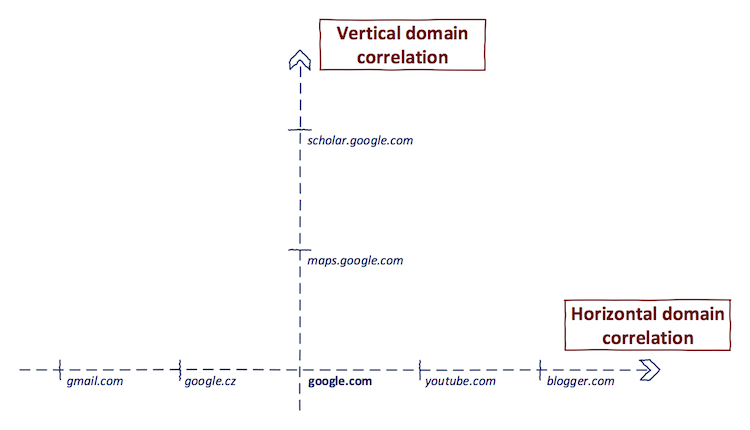
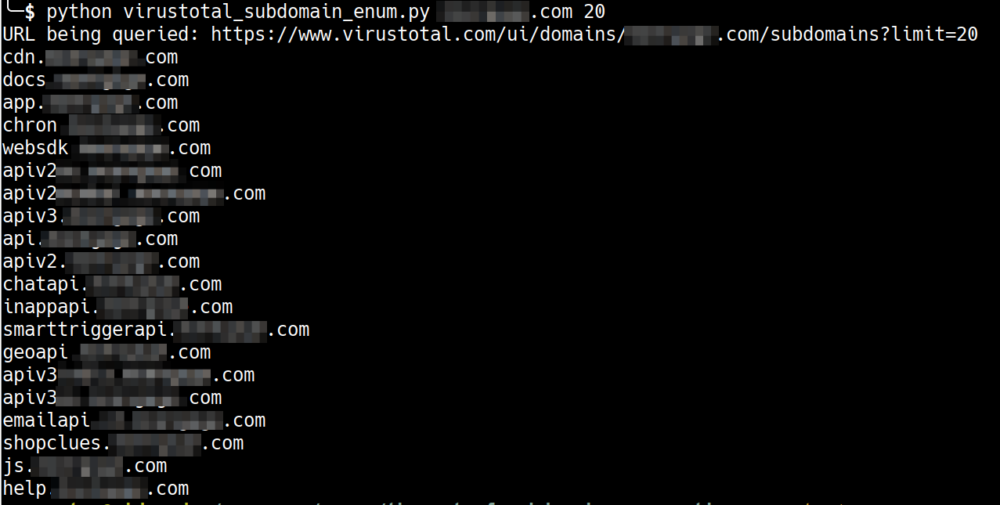
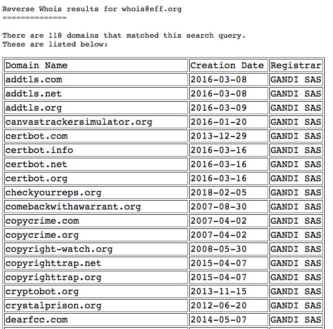
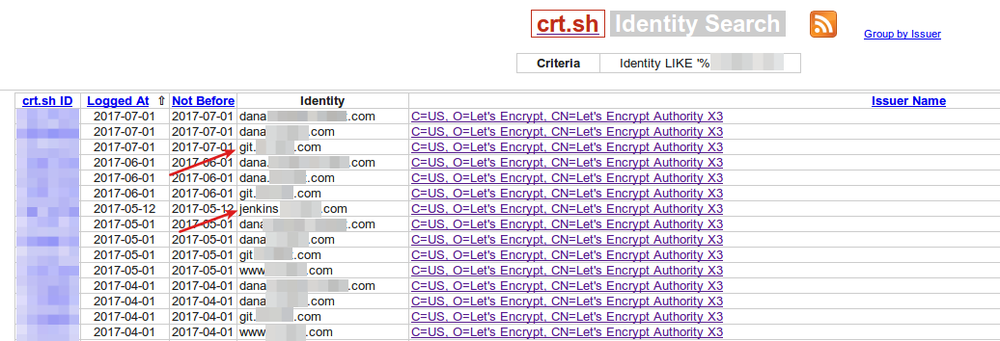
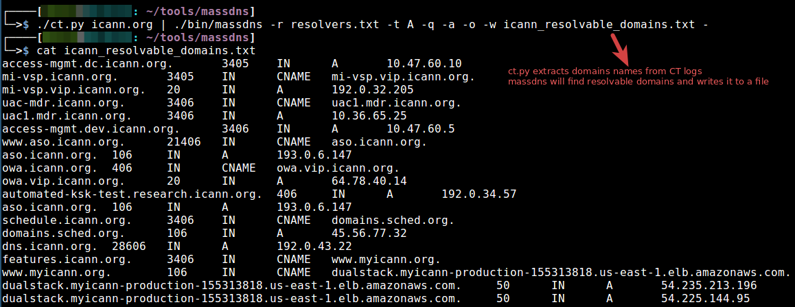
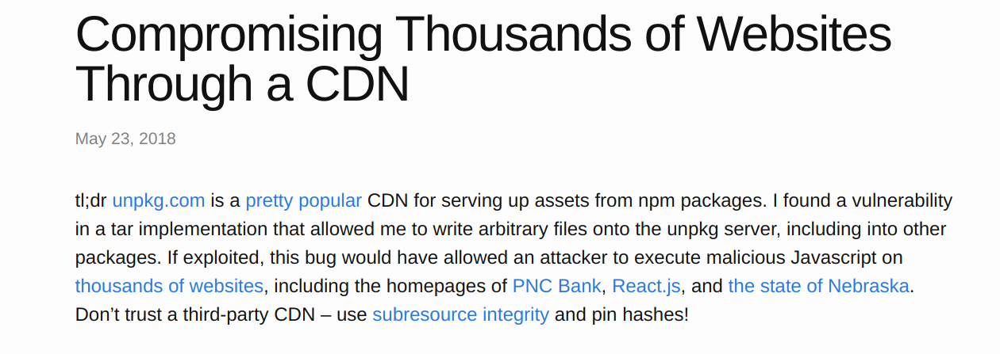
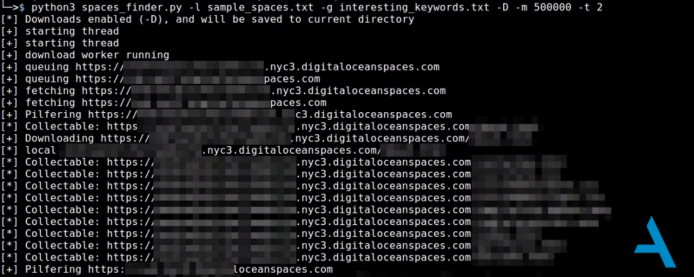
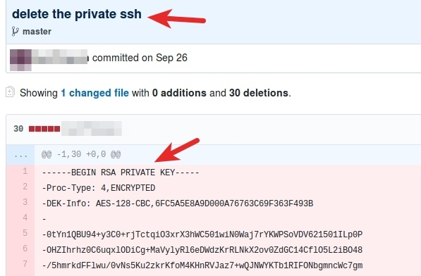

## Practical recon techniques for bug hunters & pen testers

</br>
 <!-- .element height="30%" width="30%" -->
#### Bharath Kumar

#### LevelUp 0x02 | May 26th 2018

<!-- .slide: data-background="imgs/maps_tint.jpeg" -->


## About me

- Bharath Kumar
- Live from Bangalore, India
- Security Engineer @[Appsecco](https://appsecco.com)
- **O**ffensive **S**ecurity **C**ertified **P**rofessional(OSCP)


## Demo environment

- Feel free to run the DNS & DNSSEC attacks **mentioned in this talk** against the following nameservers and domain names

<small>
<center>**Nameservers**</center>

- **ns1.insecuredns.com**
- **ns2.insecuredns.com**

<center>**Domains**</center>
- **totallylegit.in**
- **insecuredns.com**

</small>


## What is this talk about?

- This talk is about practical recon techniques that are useful for bug bounty hunters and penetration testers
- The objective of this talk is to cover exhaustive number of practical recon techniques, tools of trade and tips/tricks

Note: By practical I mean that these techniques covered can actually be used during a security assessment. 
The talk will be crisp and concise. We demonstrate quick and effective ways to apply a technique in such a way that the audience can use them in their assessments right away


## WHAT IS RECONNAISSANCE?

> **Reconnaissance is the act of gathering preliminary data or intelligence on your target.** The data is gathered in order to better plan for your attack. Reconnaissance can be performed actively or passively.


## What do we look for during recon?

1. Info to increase attack surface(domains, net blocks)
2. Credentials(email, passwords, API keys)
3. Sensitive information
4. Infrastructure details


## Enumerating domains

> The objective is to find/correlate all domain names owned by a single entity of our interest. 


## Types of domain correlation



<small>
https://0xpatrik.com/asset-discovery/
</small>


## What is sub-domain enumeration?

> Sub-domain enumeration is the process of finding subdomains for one or more domain(s).


## Using popular search engines

- Search engines like Google and Bing supports various advanced search operators to refine search queries. 
- `site:` is helpful in doing vertical domain correlation(sub-domains)
- `ip:` is helpful in doing horizontal domain correlation


## Using 3rd party information aggregators

- **VirusTotal** runs its own passive DNS replication service, built by storing DNS resolutions performed when visiting URLs submitted by users.

<small>https://www.virustotal.com/#/home/search</small>


**A script that uses VirusTotal to find sub-domains**



<small>Script - https://git.io/vhqBF</small>


## Quick tip

- I like using shell functions to quickly perform some recon tasks

```bash
find-subdomains-vt()
{ curl -s https://www.virustotal.com/ui/domains/$1/subdomains\?limit\=$2 | jq .data[].id; }
```


## Using 3rd party information aggregators

- [viewdns.info](https://viewdns.info) is a handy service for all the DNS and WHOIS related recon

 <!-- .element height="50%" width="30%" -->


## Certificate Transparency

- Under CT, a Certificate Authority(CA) will have to publish all SSL/TLS certificates they issue in a public log
- Anyone can look through the CT logs and find certificates issued for a domain
- Details of known CT log files - https://www.certificate-transparency.org/known-logs

<small>https://blog.appsecco.com/certificate-transparency-part-2-the-bright-side-c0b99ebf31a8</small>


### Certificate Transparency - side effect

- CT logs by design contain all the certificates issued by a participating CA for any given domain
- By looking through the logs, **an attacker can gather a lot of information** about an organization’s infrastructure i.e. internal domains, email addresses in a **completely passive manner**

<small>https://blog.appsecco.com/certificate-transparency-part-3-the-dark-side-9d401809b025</small>


### Searching through CT logs

- There are various search engines that collect the CT logs and let’s anyone search through them
    1. https://crt.sh/
    2. https://censys.io/
    3. https://developers.facebook.com/tools/ct/
    4. https://google.com/transparencyreport/https/ct/


<small>**A script that searches SSL/TLS certificates issued for a domain using crt.sh**</small>

 <!-- .element height="50%" width="90%" -->

<small>Script - https://git.io/vhqRd
</small>


### Keeping track of an organisation's sub-domains


<small>https://developers.facebook.com/tools/ct/
</small>


### Downside of CT for recon

- CT logs are append-only. There is no way to delete an existing entry
- The domain names found in the CT logs may not exist anymore and thus they can’t be resolved to an IP address

<small>https://blog.appsecco.com/a-penetration-testers-guide-to-sub-domain-enumeration-7d842d5570f6</small>


### CT logs + massdns

- You can use tools like [massdns](https://github.com/blechschmidt/massdns) along with CT logs script to quickly identify resolvable domain names.

```bash
python3 ct.py example.com | ./bin/massdns -r resolvers.txt -t A -a -o -w results.txt -
```




## Using certspotter

```
find-cert()
{ curl -s https://certspotter.com/api/v0/certs?domain=$1 | jq -c '.[].dns_names' | grep -o '"[^"]\+"'; }
```


## Using certdb.com

- While `crt.sh` gets the data from CT logs only where "legit" CA submit the certs to a log; CertDB is based on the scanning the IPv4 segment, domains and "finding & analyzing" all the certificates

```
curl -L -sd "api_key=API-KEY&q=Organization:\"tesla\"&response_type=3" -X POST https://certdb.com/api | tr , '\n' 
```
<small>https://certdb.com</small>


### Finding vulnerable CMS using CT

- When setting up some CMSs like Wordpress, Joomla and others, there is a window of time where the installer has no form of authentication
- If the domain supports HTTPS it will end up on a CT log(sometimes in near real time)
- If an attacker can search through CT Logs and find such a web application without authentication then he/she can take over the server


### Finding vulnerable CMS using CT

- This attack has been demonstrated by [Hanno Böck at Defcon 25](https://www.golem.de/news/certificate-transparency-hacking-web-applications-before-they-are-installed-1707-129172.html)
- He claimed to have found 5,000 WordPress installations using CT logs over a period of 3 months that he could have potentially taken over
- HD Moore also discussed this technique in his [talk at BSidesLV 2017](https://github.com/fathom6/2017-BSidesLV-Modern-Recon)


## Censys.io

- Censys aggregates SSL certificates that are a result of SSL scans on IPv4 address space and also from Certificate Transparency (CT) logs
- This is a good source of domains and also email addresses

<small>https://0xpatrik.com/censys-guide/</small>


**Extracting domains/emails from SSL/TLS certs using censys**

 <!-- .element height="60%" width="80%" -->
<small>https://github.com/yamakira/censys-enumeration</small>


## Content Security Policy(CSP)

- Content Security Policy(CSP) defines the `Content-Security-Policy` HTTP header, which allows us to create a whitelist of sources of trusted content, and instructs the browser to only execute or render resources from those sources
- So basically, Content-Security-Policy header will list a bunch of sources(domains) that might be of interest to us as an attackers.


**Extract domains from CSP headers**

<small>https://github.com/yamakira/domains-from-csp</small>




<small>https://justi.cz/security/2018/05/23/cdn-tar-oops.html</small>


## Sender Policy Framework

- A Sender Policy Framework(SPF) record and is used to indicate to recieving mail exchanges which hosts are authorized to send mail for a given domain 
- Simply put, an SPF record lists all the hosts that are authorised send emails on behalf of a domain


**Extract net blocks/domains from SPF record**


<small>https://github.com/yamakira/assets-from-spf</small>


### Domain enumeration in DNSSEC

**Authenticated Denial of Existence(RFC 7129)**

> In DNS, when client queries for a non-existent domain, the server must deny the existence of that domain. It is harder to do that in DNSSEC due to cryptographic signing.


### Zone walking NSEC - LDNS

- The `ldns-walk`(part of `ldnsutils`) can be used to zone walk DNSSEC signed zone that uses NSEC. 

```bash
# zone walking with ldnsutils
$ ldns-walk iana.org
iana.org. iana.org. A NS SOA MX TXT AAAA RRSIG NSEC DNSKEY 
api.iana.org. CNAME RRSIG NSEC 
app.iana.org. CNAME RRSIG NSEC 
autodiscover.iana.org. CNAME RRSIG NSEC 
beta.iana.org. CNAME RRSIG NSEC 
data.iana.org. CNAME RRSIG NSEC 
dev.iana.org. CNAME RRSIG NSEC 
ftp.iana.org. CNAME RRSIG NSEC 
^C
```


### Installing ldnsutils

```bash
# On Debian/Ubuntu
$ sudo apt-get install ldnsutils 
```

```bash
# On Redhat/CentOS
$ sudo yum install ldns
# You may need to do
$ sudo yum install -y epel-release
```


### NSEC3

- The NSEC3 record is like an NSEC record, but, NSEC3 provides a signed gap of **hashes of domain names**.
- Returning hashes was intended to prevent zone enumeration(or make it expensive).

```
231SPNAMH63428R68U7BV359PFPJI2FC.example.com. NSEC3 1 0 3 ABCDEF
NKDO8UKT2STOL6EJRD1EKVD1BQ2688DM A NS SOA TXT AAAA RRSIG DNSKEY NSEC3PARAM
```

```
NKDO8UKT2STOL6EJRD1EKVD1BQ2688DM.example.com. NSEC3 1 0 3 ABCDEF
231SPNAMH63428R68U7BV359PFPJI2FC A TXT AAAA RRSIG 
```


### Zone walking NSEC3

- An attacker can collect all the sub-domain hashes and crack the hashes offline
- Tools like *[nsec3walker](https://dnscurve.org/nsec3walker.html)*, *[nsec3map](https://github.com/anonion0/nsec3map)* help us automate collecting NSEC3 hases and cracking the hashes


### Zone walking NSEC3

**Zone walking NSEC3 protected zone using *nsec3walker*:**

```bash
# Collect NSEC3 hashes of a domain
$ ./collect insecuredns.com > insecuredns.com.collect
```

```bash
# Undo the hashing, expose the sub-domain information.
$ ./unhash < insecuredns.com.collect > insecuredns.com.unhash
```


### Zone walking NSEC3

```bash
# Checking the number of sucessfully cracked sub-domain hashes
$ cat icann.org.unhash | grep "icann" | wc -l
182
```

```bash
# Listing only the sub-domain part from the unhashed data
$ cat icann.org.unhash | grep "icann" | awk '{print $2;}'
del.icann.org.
access.icann.org.
charts.icann.org.
communications.icann.org.
fellowship.icann.org.
files.icann.org.
forms.icann.org.
mail.icann.org.
maintenance.icann.org.
new.icann.org.
public.icann.org.
research.icann.org.
rs.icann.org.
stream.icann.org.
tally.icann.org.
video.icann.org.
mm.icann.org.
ns.icann.org.
qa.icann.org.
ist.icann.org.
aso.icann.org.
cai.icann.org.
dev.icann.org.
exc.icann.org.
jss.icann.org.
mex.icann.org.
rrs.icann.org.
syd.icann.org.
upk.icann.org.
vip.icann.org.
crm.icann.org.
dns.icann.org.
liao.icann.org.
redis.icann.org.
svn.icann.org.
admin.icann.org.
orbis.icann.org.
jira.icann.org.
omblog.icann.org.
pptr.icann.org.
splunk.icann.org.
nomcom.icann.org.
rssac.icann.org.
sftp.icann.org.
netscan.icann.org.
```


## Installing nsec3walker

- Installation instructions are available at https://dnscurve.org/nsec3walker.html
- I used following commands to install `nsec3walker` on Ubuntu 16.04.
    - `build-essential` package is a prerequisite. 

```bash 
# Installing nsec3walker
$ wget https://dnscurve.org/nsec3walker-20101223.tar.gz
$ tar -xzf nsec3walker-20101223.tar.gz
$ cd nsec3walker-20101223
$ make
```


### Few things that changed with the advent of DevOps

1. Storage
2. Authentication
3. More and more code
4. CI/CD pipelines


## Cloud storage

- Cloud storage has gotten inexpensive, easy to setup and gained popularity
- Especially object/block storage
- Object storage is ideal for storing static, unstructured data like audio, video, documents, images and logs as well as large amounts of text.

     1. AWS S3 buckets
     2. Digital Ocean Spaces 


## What's the catch with object storage?

- Due to the nature of object storage, it is a treasure trove of information from an attacker/penetration tester perspective.
- In our experience, given an chance, users will store anything on third-party services, from their passwords in plain text files to pictures of their pets.


## Amazon S3 buckets

- AWS S3 is an object storage service by Amazon
- Buckets allow users to store and serve large amounts of data.


<small>**Attack on Accenture(Sep, 2017)- AWS S3 buckets as attack surface**
</small>


<small>https://www.upguard.com/breaches/cloud-leak-accenture</small>


<small>**AWS S3 buckets as attack surface - The trend**
</small>


<small>**AWS S3 buckets as attack surface - The trend**
</small>


### Hunting for publicly accessible S3 buckets

- Users can store Files(Objects) in a Bucket
- Each Bucket will get an unique, predictable URL and each file in a Bucket will get an unique URL as well
- There are Access controls mechanisms available at both Bucket and Object level.


### Hunting for publicly accessible S3 buckets

- Good old Google dorks

```
site:s3.amazonaws.com file:pdf 
```

```
site:s3.amazonaws.com password 
```


### Hunting for publicly accessible S3 buckets

- As buckets have predictable URL it is trivial to do a dictionary based attack
- Following tools help run a dictionary attack to identify S3 buckets

     1. [AWSBucketDump](https://github.com/jordanpotti/AWSBucketDump)
     2. [Slurp](https://github.com/bbb31/slurp)


### Digital Ocean Spaces

- Spaces is an object storage service by DigitalOcean
- It is similar to AWS S3 buckets
- Spaces API aims to be interoperable with Amazon’s AWS S3 API.


### Spaces URL pattern

- Users can store Files in a “Space”
- Each Space will get an unique, predictable URL
- Each file in a Space will get  an unique URL as well.
- Access controls mechanisms are available at Space and file level.


### Hunting for publicly accessible S3 buckets

<small>
A Space is typically considered “public” if any user can list the contents of the Space
</small>

<center>    </center>


<small>
A Space is typically considered “private” if the Space’s contents can only be listed or written by certain users
</small>


## Spaces finder

- Spaces API is interoperable with Amazon’s S3 API, we tweaked [AWSBucketDump](https://github.com/jordanpotti/AWSBucketDump) to work with DO Spaces
- *Spaces finder* is a tool that can look for publicly accessible DO Spaces using a wordlist, list all the accessible files on a public Space and download the files.

https://github.com/appsecco/spaces-finder


## Spaces finder in action


<small>https://github.com/appsecco/spaces-finder</small>


## Authentication

- With almost every service exposing an API, keys have become critical in authenticating
- API keys are treated as keys to the kingdom
- For applications, API keys tend to be achilles heel

<small>
https://danielmiessler.com/blog/apis-2fas-achilles-heel/
</small>


## Code repos for recon

- Code repos are a treasure trove during recon
- Code repos can reveal a lot from credentials, potential vulnerabilities to infrastructure details


## Github for recon

- GitHub is an extremely popular version control and collaboration platform
- Code repos on github tend to have all sorts of sensitive information
- Github also has a powerful search feature with advanced operators
- Github has a very well designed REST API
- [edoverflow](https://twitter.com/edoverflow) has a neat little guide on [GitHub for Bug Bounty Hunters](https://gist.github.com/EdOverflow/922549f610b258f459b219a32f92d10b)


## Things to focus on in Github

There are 4 main sections to look out for here.

- Repositories
- Code
- Commits(My fav!)
- Issues





## Mass Cloning on Github

- You can ideally clone all the target organization's repos and analyze them locally
- [GitHubCloner](https://github.com/mazen160/GithubCloner) by @mazen160 comes very handy to automate the process

```
$ python githubcloner.py --org organization -o /tmp/output
```

<small>
https://gist.github.com/EdOverflow/922549f610b258f459b219a32f92d10b
</small>


## Static code analysis

- Once the repos are cloned, you can do a static code analysis
- There are language specific tools to speed up and automate the process 

     1. [Brakeman](https://brakemanscanner.org/) for Ruby
     2. [Bandit](https://github.com/openstack/bandit) for Python


## Finding secrets in code manually

- Once you have the repos cloned. You can understand the code, language used and architecture
- Start looking for keywords or patterns

      - API and key. (Get some more endpoints and find API keys.)
      - token
      - secret
      - vulnerable
      - http://


## Finding secrets in code in automated fashion

There are various tools available to find juicy information in source code.

1. [Truffle Hog](https://github.com/dxa4481/truffleHog)
2. [git-all-secrets](https://github.com/anshumanbh/git-all-secrets)


## Github dorks

- Github dorks are the new Google dorks
- Github search is quite powerful feature & can be used to find sensitive data on the repos

- **A collection of Github dorks** https://github.com/techgaun/github-dorks/blob/master/github-dorks.txt

- **Tool to run Github dorks against a repo** https://github.com/techgaun/github-dorks


### Passive recon using public datasets

- There are various projects that gather Internet wide scan data and make it available to researchers and the security community.
- This data includes port scans, DNS data, SSL/TLS cert data and even data breach dumps that they can find.
- Find your needle in the haystack.


## Why use public data sets for recon?

- To reduce dependency on 3rd party APIs and services
- To reduce active probing of target infrastructure
- More the sources better the coverage
- Build your own recon platforms


## Let's look at some public datasets

| Name          | Description     | Price |
| ------------- |:-------------:| -----:|
| [Sonar](https://scans.io) | FDNS, RDNS, UDP, TCP, TLS, HTTP, HTTPS scan data  |  FREE |
| [Censys.io](https://www.censys.io/)| TCP, TLS, HTTP, HTTPS scan data    | FREE |
| [CT](https://www.certificate-transparency.org/)| TLS | FREE |

</br>
<small>
https://github.com/fathom6/inetdata
</small>


## Let's look at some public datasets

| Name          | Description     | Price |
| ------------- |:-------------:| -----:|
| [CZDS](https://czds.icann.org/) | zone files for "new" global TLDs  | FREE |
| [ARIN](https://www.arin.net) | American IP registry information | FREE |
| [CAIDA PFX2AS IPv4](http://data.caida.org/datasets/routing/routeviews-prefix2as) | Daily snapshots of ASN to IPv4 mappings | FREE |


## Let's look at some public datasets

| Name          | Description     | Price |
| ------------- |:-------------:| -----:|
| [US Gov](https://raw.githubusercontent.com/GSA/data/gh-pages/dotgov-domains/current-full.csv) | US government domain names | FREE |
| [UK Gov](https://www.gov.uk/government/publications/list-of-gov-uk-domain-names) | UK government domain names | FREE |
| [RIR Delegations](http://ftp.arin.net/pub/stats/) | Regional IP allocations | FREE |

</br>
<small>
https://github.com/fathom6/inetdata
</small>


## Let's look at some public datasets

| Name          | Description     | Price |
| ------------- |:-------------:| -----:|
| [PremiumDrops](http://premiumdrops.com/) | DNS zone files for com/net/info/org/biz/xxx/sk/us TLDs  | $24.95/mo |
| [WWWS.io](https://wwws.io/) | Domains across many TLDs (~198m)  |   $9/mo |
| [WhoisXMLAPI.com](https://WhoisXMLAPI.com/)  | New domain whois data  | $109/mo |

<small>
https://github.com/fathom6/inetdata
</small>


### Rapid7 Forward DNS dataset

- Rapid7 publishes its Forward DNS study/dataset on `scans.io` project(it's a massive dataset, 20+ GB compressed & 300+ GB uncompressed)
- This dataset aims to discover all domains found on the Internet


## Hunting sub-domain in FDNS dataset

- The data format is a gzip-compressed JSON file so we can use `jq` utility to extract sub-domains of a specific domain:

```
curl --silent -L https://opendata.rapid7.com/sonar.fdns_v2/2018-04-21-1524297601-fdns_any.json.gz | pigz -dc | head -n 10 | jq .
```

```bash
cat 2018-04-21-1524297601-fdns_any.json.gz | pigz -dc | grep "\.example\.com" | jq .name
```

<small>
https://opendata.rapid7.com/about/
</small>


## Hunting sub-domain in FDNS dataset


<center>    </center>
<small>https://github.com/appsecco/bugcrowd-levelup-subdomain-enumeration</small>


## ICANN.ORG subdomains

<small>Number of **unique, resolvable sub-domains** each enumeration technique found independently against icann.org
</small>

<center>    </center>


## TALK MATERIAL

https://github.com/appsecco/practical-recon-levelup0x02


## Take away

**A gitbook on sub-domain enumeration**

https://appsecco.com/books/subdomain-enumeration/


## References

<small>
- https://www.certificate-transparency.org/
- https://www.cloudflare.com/dns/dnssec/how-dnssec-works/
- https://www.cloudflare.com/dns/dnssec/dnssec-complexities-and-considerations/
- http://info.menandmice.com/blog/bid/73645/Take-your-DNSSEC-with-a-grain-of-salt
- https://github.com/rapid7/sonar/wiki/Forward-DNS

</small>


<section data-background-image="imgs/appsecco.png">

</section>


### Thanks 

[@yamakira_](http://twitter.com/yamakira_)